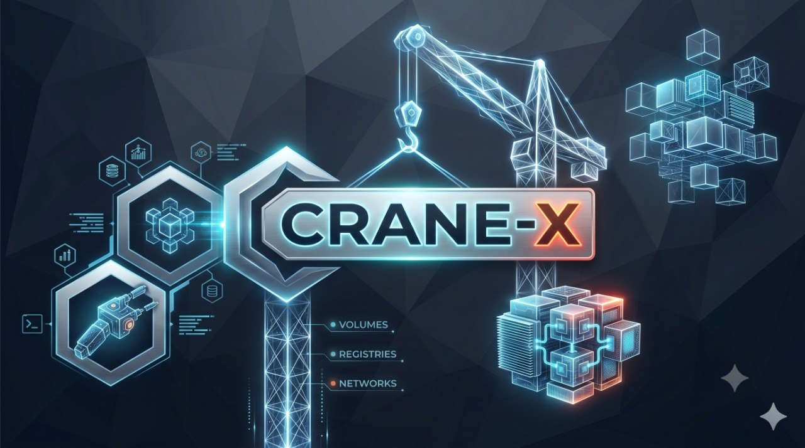
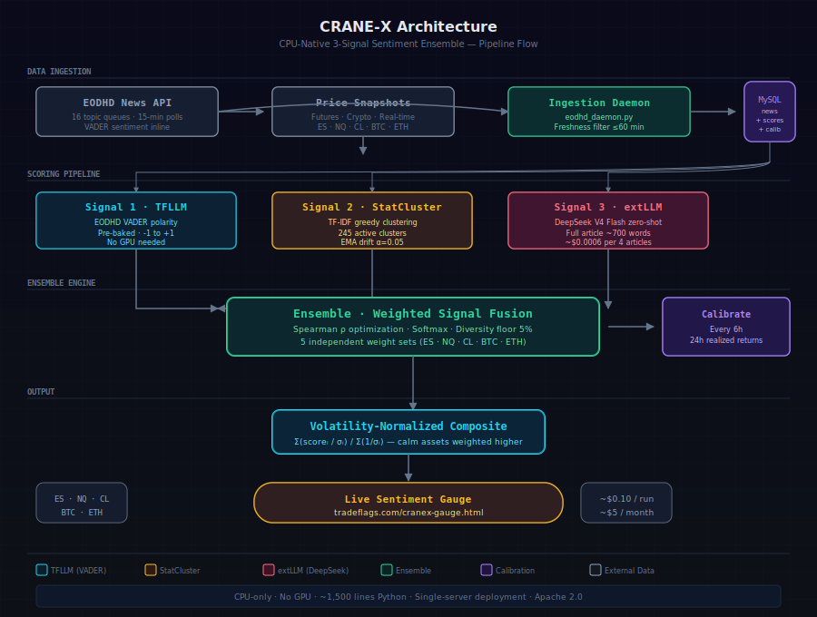

<p align="center">
  
</p>

<p align="center">
  <h1 align="center">CRANE-X</h1>
  <h3 align="center">CPU-Native 3-Signal Sentiment Ensemble · 5 Assets · Live Gauge</h3>
</p>

<p align="center">
  <a href="LICENSE"></a>
  <a href="https://tradeflags.com/cranex-gauge.html"></a>
  <a href="https://tradeflags.com/cranex.html"></a>
  
  
  
  
</p>

---

## What is CRANE-X?

**CRANE-X** is a CPU-native, three-signal sentiment ensemble that ingests financial news and outputs **per-asset sentiment scores** for five major instruments — S&P 500 E-mini Futures (ES), Nasdaq 100 E-mini Futures (NQ), Brent Crude Oil (CL), Bitcoin (BTC), and Ethereum (ETH).

Unlike monolithic sentiment models that apply one-size-fits-all scoring, CRANE-X treats each asset as an independent optimization problem. The same news article can (and should) affect different assets differently — a rate cut is bullish for equities but neutral-to-negative for crypto. CRANE-X captures this.

**Key innovations:**

- **Three independent signals** — VADER-style polarity, statistical clusters (245 adaptive TF-IDF groups), and a zero-shot LLM scoring on full article content
- **Per-asset calibration** — Each of the 5 assets has its OWN ensemble weights, optimized every 6 hours via Spearman rank correlation against realized 24-hour forward returns
- **Volatility-normalized compositing** — The aggregate signal weights each asset inversely to its realized volatility (1/σ), preventing high-noise instruments from dominating
- **CPU-only, ~$5/month** — Full pipeline runs on a single CPU server. The extLLM signal scores ~700-word articles at ~$0.0006 per 4-article batch
- **Live gauge** — Real-time multi-asset sentiment dashboard at [tradeflags.com/cranex-gauge.html](https://tradeflags.com/cranex-gauge.html)

---

## Live Sentiment Gauge

<p align="center">
  <a href="https://tradeflags.com/cranex-gauge.html">
    
  </a>
</p>

The gauge displays real-time volatility-normalized composite sentiment across all 5 assets, updated every 15 minutes. Each asset shows its current ensemble score, regime state (bullish/bearish/neutral/volatile), and realized volatility.

---

## Architecture

<p align="center">
  
</p>

### Data Pipeline

| Step | Component | Schedule | Description |
|------|-----------|----------|-------------|
| **1** | **Ingest** | Every 15 min | Poll 16 EODHD topic queues (technology, oil, fed, crypto, earnings, etc.) with concurrent price snapshots |
| **2** | **Freshness filter** | Inline | Discard articles older than 60 minutes — tight price correlation window |
| **3** | **TFLLM signal** | Every 30 min | EODHD's pre-baked VADER-style polarity, stored as Signal 1 |
| **4** | **StatCluster** | Every 30 min | TF-IDF vectorization → greedy clustering against 245 active groups with EMA centroid drift (α=0.05) |
| **5** | **extLLM signal** | Every 30 min | Zero-shot DeepSeek V4 Flash scoring on full article content (~700 words), batched in groups of 4 |
| **6** | **Ensemble fusion** | Per-article | Weighted sum per asset using optimized weights + diversity floor (5%) |
| **7** | **Calibrate** | Every 6 hours | Compute Spearman ρ between each signal and realized 24h returns; softmax optimization |
| **8** | **Composite** | Per-article | Volatility-normalized weighted average across all 5 assets |

---

## Three-Signal Ensemble

### Signal 1 — TFLLM (VADER Polarity)
**Cost: $0** (bundled with EODHD news API response)

Every EODHD news article comes with pre-baked sentiment: polarity (-1 to +1), and negative/neutral/positive weights (summing to 1). CRANE-X stores these as-is — no additional computation needed. This is the baseline signal.

### Signal 2 — StatCluster (TF-IDF Greedy Clustering)
**Cost: $0** (CPU-only computation)

CRANE-X tokenizes each article (title + tags + weighted content), computes TF-IDF vectors against a global vocabulary of ~4,000 financial terms, and assigns each article to the closest of 245 active semantic clusters. Each cluster stores the average 24-hour forward price reaction across ALL 5 assets simultaneously — meaning a cluster labeled "rate cut expectations" knows how ES, NQ, CL, BTC, and ETH historically moved after similar articles.

Centroids drift via EMA (α=0.05) so the system adapts to changing market regimes without full retraining.

### Signal 3 — extLLM (DeepSeek Zero-Shot)
**Cost: ~$0.0006 per 4-article batch**

A DeepSeek V4 Flash model scores the full article content (title + ~700 words body) using a structured prompt that returns a JSON array of `{score, confidence, themes}`. Temperature is clamped to 0.1 for deterministic output. 405 full-length articles scored at total cost of $0.10.

### Per-Asset Calibration

Every 6 hours, CRANE-X computes the Spearman rank correlation between each signal and the realized 24-hour forward price return — separately for each asset. Weights are optimized via softmax over positive ρ² values with a 5% diversity floor (no signal ever drops below 5% weight).

```
Example calibration snapshot for NQ:
  ρ eodhd = 0.31,  ρ stat = 0.24,  ρ llm = 0.12
  → weights: eodhd = 0.52, stat = 0.33, llm = 0.15
  → ensemble ρ = 0.37  (combined outperforms any single signal)
```

### Volatility-Normalized Composite

```
composite = Σ(score_i / σ_i) / Σ(1/σ_i)
```

ES (vol ~15%) contributes more weight than BTC (vol ~55%) because its sentiment signal carries less noise. This prevents high-volatility assets from drowning out the aggregate signal.

---

## Comparison: CRANE vs CRANE-X

| Component | Original CRANE | CRANE-X |
|-----------|---------------|---------|
| **News Source** | TradeFlags NewsFeed API | EODHD topic tags (16 queues) |
| **Price Source** | Bundled with news | Separate price API |
| **Sentiment** | FinBERT lexicon (248 terms) | Pre-baked VADER polarity |
| **Cluster Vocab** | By IDF (rare terms) | By doc frequency (common terms) |
| **Tokenization** | Headline only (15 words) | Title + tags + weighted content |
| **Assets** | ES, NQ, CL, BTC | + ETH |
| **Ensemble Weights** | Single set (ES only) | 5 independent, per-asset |
| **Composite** | None | Volatility-normalized (1/σ) |
| **LLM Input** | Never ran reliably | Full article (700+ words) |
| **Freshness** | None | 15-min max age |
| **Daemon** | N/A | systemd, 30s check loop |

---

## Quick Start

### Prerequisites

- Python 3.8+
- MySQL 8+ (or [MariaDB](https://mariadb.org/))
- An [EODHD API key](https://eodhd.com/) (free tier sufficient for testing)
- (Optional) A [DeepSeek API key](https://platform.deepseek.com/) for the extLLM signal

### Setup

```bash
# Clone the repository
git clone https://github.com/a3igner/crane-x.git
cd crane-x

# Install dependencies
pip install -r requirements.txt

# Configure
cp config.yaml.example config.yaml
cp config.env.example .env

# Edit .env with your credentials
#   EODHD_API_KEY=your_key_here
#   MYSQL_HOST=127.0.0.1
#   MYSQL_USER=root
#   MYSQL_PASSWORD=your_password
#   MYSQL_DATABASE=cranex

# Initialize the database
mysql -u root -p cranex < sql/001_eodhd_schema.sql
mysql -u root -p cranex < sql/002_cluster_tables.sql
mysql -u root -p cranex < sql/003_ensemble_schema.sql

# Run a single ingest cycle
python3 run_pipeline.py --ingest

# Or run the continuous daemon
python3 eodhd_daemon.py
```

### Run Scoring

```bash
# Compute statistical clusters and ensemble scores
python3 scoring/scorer.py

# Run LLM scoring (requires DeepSeek API key)
python3 scoring/llm_scorer.py

# Calibrate ensemble weights
python3 scoring/calibrate.py

# View the live API output
python3 scoring/sentiment_api.py --pretty
```

---

## Project Structure

```
crane-x/
├── eodhd_daemon.py          # Continuous ingestion daemon (systemd-ready)
├── eodhd_ingest.py          # EODHD news polling + price snapshots
├── run_pipeline.py          # Pipeline orchestrator
├── scoring/
│   ├── scorer.py            # Ensemble scoring engine (3-signal fusion)
│   ├── llm_scorer.py        # DeepSeek LLM scoring client
│   ├── calibrate.py         # Per-asset weight optimizer
│   ├── sentiment_api.py     # JSON API endpoint for the gauge
│   └── hourly_status.py     # Status reporter
├── utils/
│   ├── config.py            # Centralized config loader (yaml + env)
│   ├── db.py                # MySQL connection utilities
│   └── stat_scorer_x.py     # TF-IDF cluster learner
├── sql/
│   ├── 001_eodhd_schema.sql      # News ingestion tables
│   ├── 002_cluster_tables.sql     # Cluster dictionary + vocab
│   └── 003_ensemble_schema.sql    # Scores + calibration + volatility
├── config.yaml.example      # Configuration template
├── config.env.example       # .env template
├── config.js                # Frontend API URL
├── cranex-news20.html       # Latest 20 headlines widget
├── sentiment-gauge.html     # Live sentiment dashboard
├── crane-x-hero-image.png   # Project hero image
├── docs/
│   └── architecture.svg     # Architecture diagram
├── requirements.txt
```

---

## Configuration

CRANE-X uses a two-file split pattern to keep secrets out of version control:

| File | Contents | Git-tracked? |
|------|----------|-------------|
| `config.yaml` | API base URLs, pipeline params, ticker lists | No |
| `config.yaml.example` | Same structure with placeholder values | Yes |
| `.env` | API keys, DB credentials | No |

The loader (`utils/config.py`) reads with priority: **environment variables > .env > config.yaml defaults**.

### Required Secrets (in `.env`)

```
EODHD_API_KEY=your_eodhd_api_key
MYSQL_HOST=127.0.0.1
MYSQL_PORT=3306
MYSQL_USER=root
MYSQL_PASSWORD=your_password
MYSQL_DATABASE=cranex
DEEPSEEK_API_KEY=your_deepseek_key   # Optional — only needed for LLM signal
```

---

## Academic Paper

The CRANE-X architecture and results are described in the accompanying academic paper:

> **Aigner, A.A.** (2026). *CRANE-X: CPU-Native Adaptive Sentiment Ensemble with Per-Asset Calibration, Volatility-Normalized Compositing, and LLM-Enhanced Content Understanding for Multi-Asset Financial News Analysis*. Available at [Tradeflags.com](https://tradeflags.com/cranex.html).

The complete LaTeX source and compiled PDF are in the `paper/` directory.

### BibTeX Citation

```bibtex
@techreport{aigner2026cranex,
  author      = {Andreas A. Aigner},
  title       = {{CRANE-X}: CPU-Native Adaptive Sentiment Ensemble with Per-Asset
                 Calibration, Volatility-Normalized Compositing, and LLM-Enhanced
                 Content Understanding for Multi-Asset Financial News Analysis},
  institution = {Tradeflags.com},
  year        = {2026},
  url         = {https://tradeflags.com/cranex.html}
}
```

---

## Cost Economics

| Signal | Cost per Run | Monthly (288 runs) |
|--------|-------------|-------------------|
| **TFLLM** (VADER polarity) | $0 | $0 |
| **StatCluster** (TF-IDF) | $0 | $0 |
| **extLLM** (DeepSeek V4 Flash) | ~$0.0026 | ~$1.87 |
| **EODHD API subscription** | — | ~$3/month (basic plan) |
| **Server (CPU-only)** | — | ~$5/month |
| **Total** | | **~$10/month** |

405 full-length articles scored with the LLM signal at a total cost of $0.10.

---

## License

This project is licensed under the **Apache 2.0 License**. See the [LICENSE](LICENSE) file for details.

---

<p align="center">
  <sub>Built by <a href="https://tradeflags.com">Andreas A. Aigner</a> · Tradeflags.com</sub>
  <br>
  <sub>CPU-native · Zero GPU · All-weather sentiment</sub>
</p>
